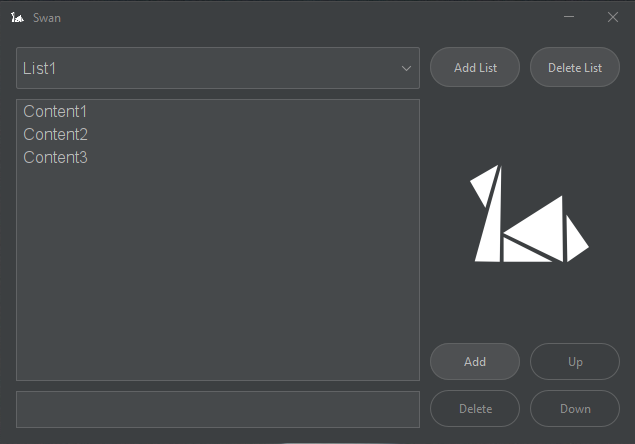
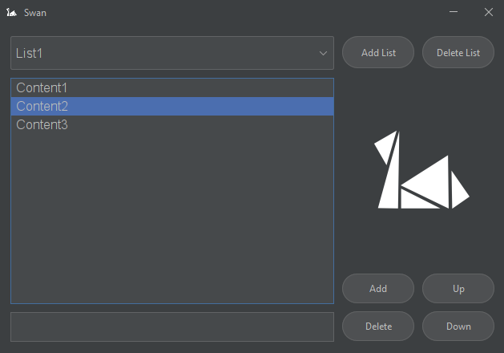
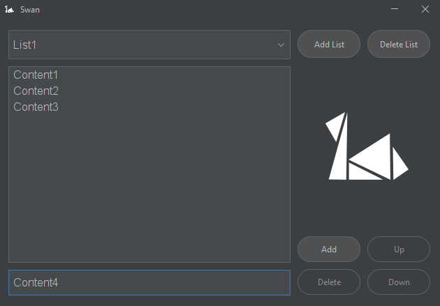
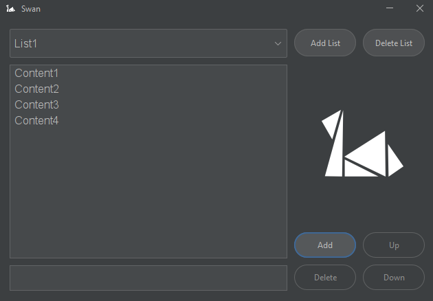
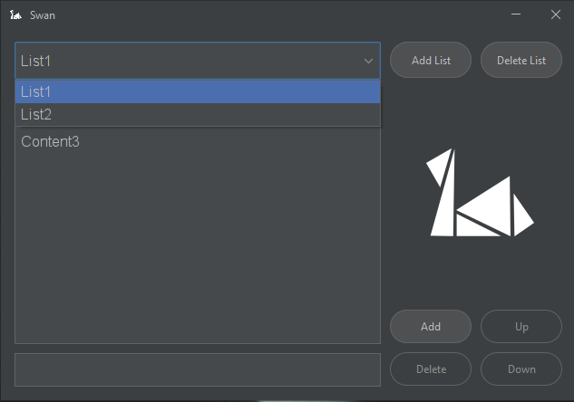
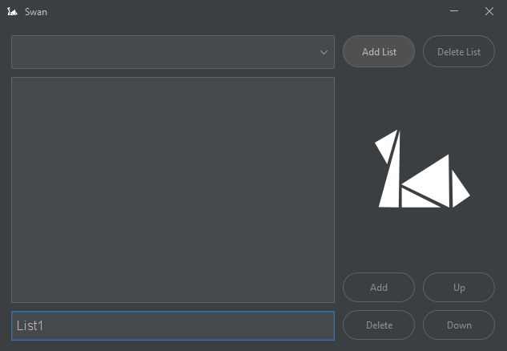
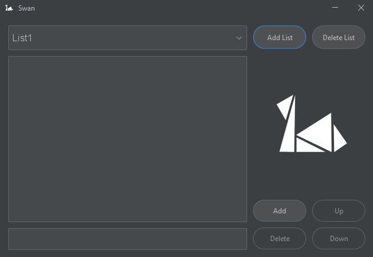

# Swan

## Overview
Swan is a lightweight and clean organizing tool that gives users the ability to have their organizational lists gathered all into one place. It achieves this by letting users create multiple ranked lists and add, remove, edit, promote, demote their contents. The lists are stored locally in the directory "$user/Documents/Swan/" in binary form as to not be "directly" readable by humans. At the start of the application the specific folder is read and can theoretically contain an indefinite number of lists as the application handles them dynamically.

## Code
The entire code is within the Swan.java class. While i have tried to adhere to
good coding practices I acknowledge that the code definitely needs refactoring in certain areas. You are welcome to examine the code before running it on your system.

## How To Execute
1. Clone the repository
```bash
git clone https://www.github.com/xMik3/swan.git
```

2. Compile And Install Dependencies (You need to have maven installed)
```bash
mvn clean package
```
3. Execute the generated jar
```bash
java -jar ./target/Swan-1.0-SNAPSHOT.jar
```

## User Interface


### Content Functionality



#### Content Addition

Before Addition


After Addition


### List Functionality



#### List Addition

Before Addition


After Addition



